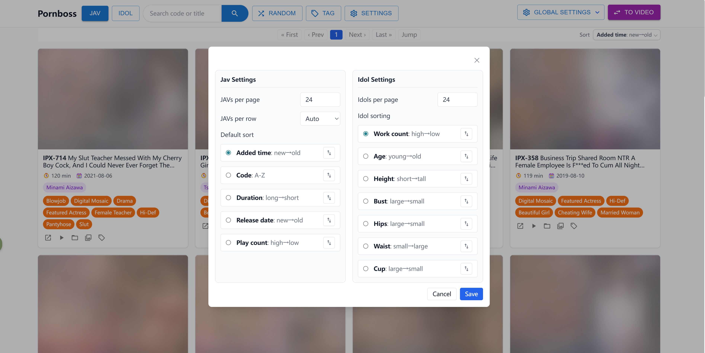
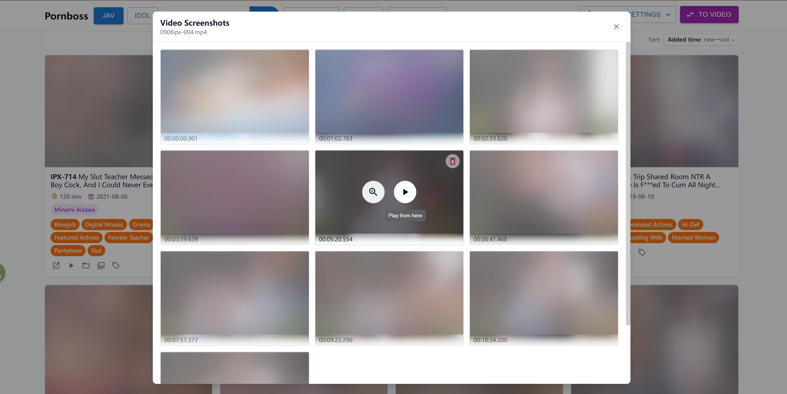
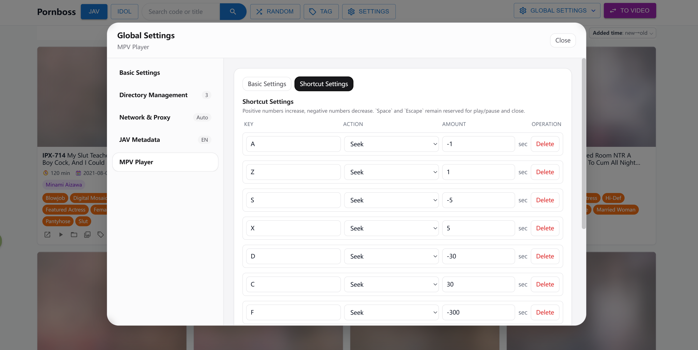

<h1 align="center">JavBoss</h1>

<p align="center">An all-in-one solution for local adult video collections: automatically scan folders, generate cover screenshots, detect JAV titles and fetch metadata, provide powerful search for videos and JAV titles, and play videos quickly through the bundled mpv player.</p>

<p align="center">
  <a href="https://github.com/Solr159/JavBoss/releases"></a>
  <a href="https://github.com/Solr159/JavBoss/stargazers"></a>
  <a href="https://github.com/Solr159/JavBoss/releases"></a>
  <a href="https://go.dev/"></a>
</p>

<p align="center">
  <a href="./README.md">中文</a> | <a href="./README.en.md">English</a>
</p>

## What Is JavBoss?

JavBoss is a local web app that provides full-featured, automated management for local adult video collections, with especially strong support for managing and searching Japanese AV.

The browsing experience is somewhat similar to JavDb, JavBus, and JavLibrary, but JavBoss optimizes and extends that style for a more direct, powerful, and user-friendly local media library experience.

If you do not want to deal with complex tools or configuration and just want to import your library and start browsing comfortably, JavBoss is the ideal choice.

## Quick Start

### 1. Download

Click the link for your system, download the latest release package, and extract it:

- [Windows](https://github.com/Solr159/JavBoss/releases/download/v1.8.0/javboss-v1.8.0-windows-x86_64.zip)
- [Linux](https://github.com/Solr159/JavBoss/releases/download/v1.8.0/javboss-v1.8.0-linux-x86_64.zip)
- [macOS-x86_64](https://github.com/Solr159/JavBoss/releases/download/v1.8.0/javboss-v1.8.0-macos-x86_64.zip) for Intel-based macOS
- [macOS-arm64](https://github.com/Solr159/JavBoss/releases/download/v1.8.0/javboss-v1.8.0-macos-arm64.zip) for Apple Silicon macOS

You can also visit the [Releases](https://github.com/Solr159/JavBoss/releases) page to view all versions.

### 2. Start The App

- Windows: double-click `javboss.exe`. If SmartScreen blocks it on first launch, click "More info" and continue.
- macOS: open a terminal and run `javboss.command`.
- Linux: open a terminal and run `javboss`.

After launch, JavBoss will try to open your browser automatically. If it does not, open the local address shown in the terminal manually. Keep the terminal window open while JavBoss is running.

### 3. Set JAV Metadata Language

Open `Global Settings` -> `JAV Metadata`, switch the metadata language to `English`, and save.

### 4. Add Your Local Folders

- Open `Global Settings` -> `Directory Management`, then add the local folders that store your videos.
- Scanning will continue in the background. Use the button in the upper-right corner to switch between Video mode and JAV mode to check scan progress.
- In JAV mode, actress, maker, series, and other metadata will be completed automatically over time. Please be patient.

## Core Philosophy

- **Ready to use, with no external dependencies**: JavBoss includes all runtime dependencies it needs. Add your local folders, wait a short moment, and start using it right away.
<br>

- **Fully automated managed folder service**: JavBoss provides a managed service for local media folders. Once folder contents change in any way, all data updates are handled automatically by JavBoss. You can think of JavBoss as maintaining a real-time, complete mapping of your folder contents. Data updates take time, so they are not zero-latency, but JavBoss guarantees eventual consistency.
<br>

- **Non-intrusive design**: JavBoss respects your media folders. It only reads folder contents and never modifies them, so you do not need to worry about generated junk such as `.nfo` files or cover images appearing inside your own folders. This also lets JavBoss work alongside other video managers without interfering with them.
<br>

- **Data that stays safe**: All JavBoss data is stored in the project's `data/` directory. As long as you keep `data/` safe, your library data remains available when upgrading or moving to another computer.

## ✨ Features

### 1. 🔎 Powerful JAV Metadata Collection And Search

JavBoss extracts JAV codes from filenames, including common patterns such as `IPX-633`, `SSIS-001`, and `ipx633_ch`, then places recognized videos into the JAV library.

- Integrates multiple data sources internally, including javbus, avmoo, theporndb, and javdatabase, and fetches each type of information from the most suitable source.
- Automatically fetches title, release date, cover art, actresses, tags, and other basic metadata.
- Automatically fetches and completes actress profiles, including height, Chinese and English names, measurements, birthday, and more.
- Automatically fetches and completes JAV maker and series information.
- Supports Chinese and English JAV metadata fetching, freely switchable.
- Provides powerful sorting for JAV titles and actresses, including release date, duration, play count, height, age, measurements, and more.
- Provides powerful search and filtering, with editable complex queries covering keywords, actresses, tags, makers, series, and more for paged browsing.
- Provides powerful random browsing, including global random mode and random results under the current filters, with the ability to exit random mode at any time.

### 2. 📁 Smart Folder Management And Portable Data

After you add local media folders, JavBoss continuously syncs their contents in the background. Folder changes are detected and refreshed promptly, so newly added, removed, or moved files are reflected in the media library. Indexed videos can be browsed immediately while scanning and metadata completion continue in the background.

- Supports multiple media folders, including local disks, NAS mounts, and removable drives.
- Automatically generates video cover screenshots, stores video fingerprints, and tries to associate videos with JAV codes based on filenames.
- Lets you freely choose enabled folders, with disabled folder content hidden automatically.
- Keeps historical index data when a folder is temporarily unavailable, so removable-drive libraries reappear after the drive is connected again.
- Binds tags, JAV associations, and metadata to video fingerprints, so common move and rename workflows do not require retagging.
- Stores the database, covers, thumbnails, and runtime data under `data/`; copy this directory to upgrade or migrate.

### 3. ⏯️ Built-In mpv Playback

JavBoss integrates [mpv](https://github.com/mpv-player/mpv) playback, so clicking a video can launch a lightweight, high-performance local player that handles large files, high bitrates, and many common video formats.

- Plays the original local file through mpv, avoiding browser playback format limitations.
- Supports playback options such as default volume, window size, and always-on-top behavior.
- Supports custom hotkeys for actions such as seeking and volume adjustment.
- Bundles the [ModernZ](https://github.com/Samillion/ModernZ) OSC script, so mpv playback uses a more modern on-screen player UI by default.
- Supports taking screenshots at any moment during mpv playback, with screenshot files stored under `data/`.
- In both the video library and JAV library, the screenshot panel previews all mpv screenshots in timestamp order.
- The screenshot panel supports enlarged previews, deleting screenshots, and resuming playback directly from a screenshot timestamp.
- Lets you choose the default player in global settings, supports playback through mpv or the system player, and can reveal the file in its containing folder.

### 4. 🧭 Simple, Practical UI

The frontend is designed around finding the right video quickly. Common operations are centered on filtering, sorting, tagging, and random discovery instead of dense configuration screens.

- Supports a general video library, a JAV title library, and actress-centric browsing.
- Supports search, tag filters, multi-select batch tagging, and bulk tag replacement.
- Supports random browsing so older forgotten videos can surface again.
- Supports sorting by recently added, filename, duration, release date, play count, and more.

## Screenshots

<p align="center">
  
</p>

<p align="center">
  
</p>

<p align="center">
  
</p>

<p align="center">
  
</p>

<p align="center">
  
</p>

<p align="center">
  
</p>

<p align="center">
  
</p>

<p align="center">
  
</p>

<p align="center">
  
</p>

<p align="center">
  
</p>

<p align="center">
  
</p>

<p align="center">
  
</p>

## How To Upgrade Versions

After downloading and extracting a new version, copy the old version's `data/` directory into the new version directory. Keep the old version and a data backup until you confirm the new version runs correctly.

## Notes

- JavBoss is a local media library manager, not an online streaming site.
- Initial JAV metadata and cover fetching depend on external website availability. If access is restricted in your region, prepare a working network/proxy environment yourself.
- When importing a large library for the first time, scanning, cover downloads, metadata completion, and thumbnail generation can take some time.
- The release package includes a `config.toml` file in its root directory. By default `port = 0`, so JavBoss uses a random startup port. You can change it any time if you need a fixed port.

## Q&A

- Q: Why is JavBoss a local web app instead of a desktop app?
- A: This is not a technical limitation. It is mainly a user experience choice. For example, browsers have several unique advantages:
  1. If you want to view JAV titles from actress A and actress B while searching for videos containing keyword C, you can simply open multiple browser tabs.
  2. If you want to open a new page without losing the current page, use Ctrl + click or right-click and choose to open it in a new tab.
  3. If you click the wrong thing, the browser back button takes you back immediately.
  4. If you see a JAV title or actress name and want to search for it, select the text, right-click, and search it with Google.

<br>

- Q: Do I need to keep external network access available while using JavBoss?
- A: No. JavBoss reads all existing information from the `data/` directory, and anything you have already seen remains available offline. Without external network access, JavBoss cannot continue fetching or updating JAV information, but already indexed information is not affected.

<br>

- Q: After adding a folder, how do I know when scanning is finished? Do I need to wait?
- A: No. JavBoss scans and completes metadata in the background, so you can start using it right after adding a folder. You can also close the app at any time; scanning will continue the next time it starts.

<br>

- Q: After adding a folder, why do my JAV videos appear in regular video mode?
- A: This is expected. JAV metadata fetching has some delay compared with video scanning, so JAV videos may first appear as regular videos. If external network access is working, wait a moment and they will disappear from regular video mode and appear in JAV mode.

<br>

- Q: How do I add newly downloaded videos or remove videos I no longer want?
- A: Move videos into or out of a managed folder. JavBoss syncs folder state, so additions, moves, and removals are reflected in the library.

<br>

- Q: My video folder is on a removable drive. Will data be lost if I start JavBoss without the drive connected?
- A: No. When a folder is unavailable, JavBoss keeps the indexed data. The library will reappear after the drive is connected again.

<br>

- Q: One removable drive is running out of space. What should I do if I need to move the folder to a new drive?
- A: Move the folder directly, then update its path in `Directory Management`. You do not need to worry about data loss; JavBoss will handle it.

<br>

- Q: How do I migrate to another computer?
- A: For the same operating system, copy the entire JavBoss directory to the new computer and run it directly. For cross-platform migration, download the matching JavBoss package on the new computer, then copy the old computer's `data/` directory into the new JavBoss directory. If your video folder paths also changed, update them manually in `Directory Management`.

## Developer Notes

### Development Dependencies

- Go `1.25.1` or later
- Node.js and npm

### Tech Stack

- Backend: Go + Gin + GORM + SQLite
- Frontend: React + Vite + Tailwind + Zustand
- Media probing: `ffprobe`
- Thumbnail screenshot generation: `ffmpeg` on macOS, `mpv` on other platforms
- Playback and manual screenshots: `mpv`

### Common Commands

Download dependencies (`ffprobe` + `mpv`, plus `ffmpeg` on macOS):

```bash
./scripts/cli.sh download linux-x86_64
```

Install frontend dependencies:

```bash
cd web
npm install
```

Start the backend:

```bash
./scripts/cli.sh dev backend
```

Start the frontend:

```bash
./scripts/cli.sh dev frontend
```

Frontend checks:

```bash
cd web
npm run lint
npm run build
```

Build a release:

```bash
scripts/cli.sh release linux-x86_64 v0.1.0
```

### Project Structure

```text
cmd/server             Go server entrypoint
cmd/javprovider        JAV metadata provider debug entrypoint
internal/common        Shared global state and configuration
internal/db            GORM queries and SQLite storage
internal/jav           JAV metadata and actress profile fetching
internal/manager       Cover download and screenshot jobs
internal/models        Data model definitions
internal/mpv           mpv playback, hotkey, and manual screenshot configuration
internal/server        HTTP API and static asset routing
internal/service       Folder scanning, JAV detection, metadata completion
internal/util          File, system, proxy, and video probing utilities
web/                   React + Tailwind frontend
scripts/cli            Development, dependency download, and release helper CLI
data/                  Runtime database, covers, thumbnails, and cache
```
