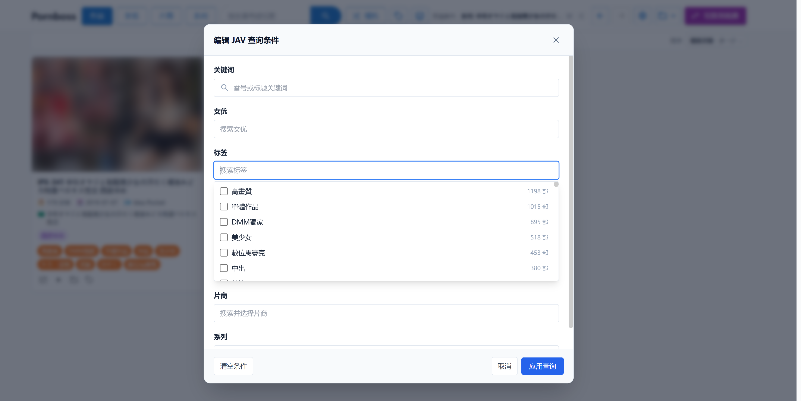
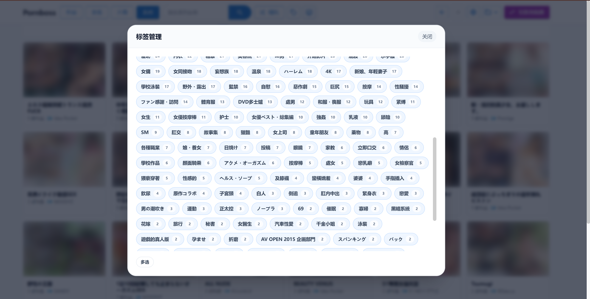
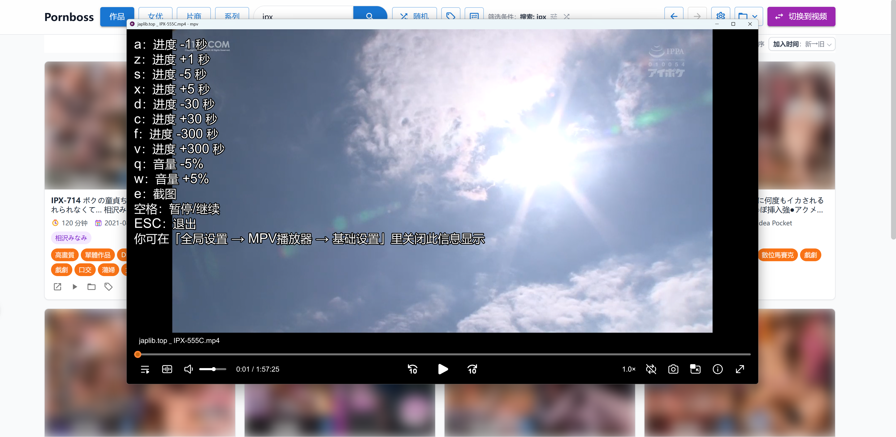
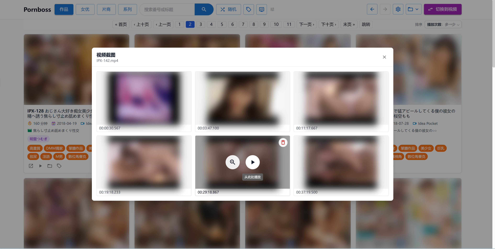
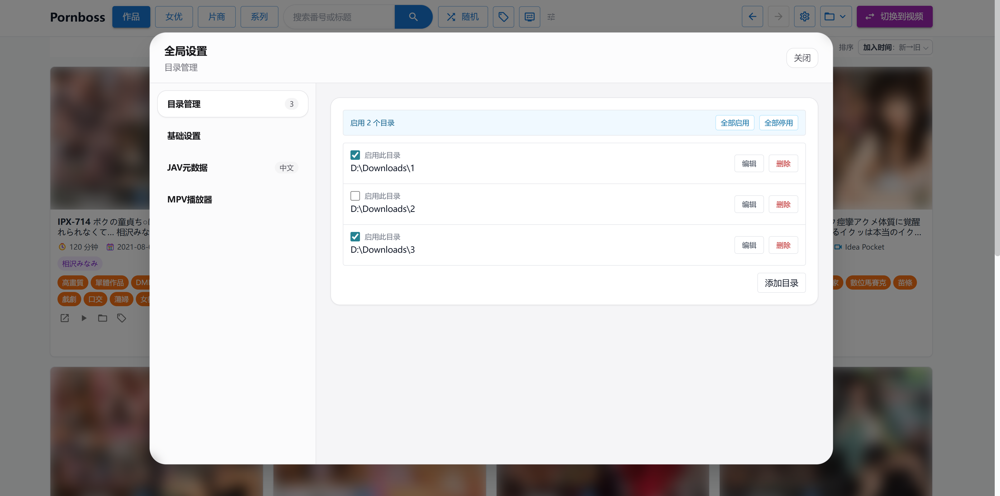
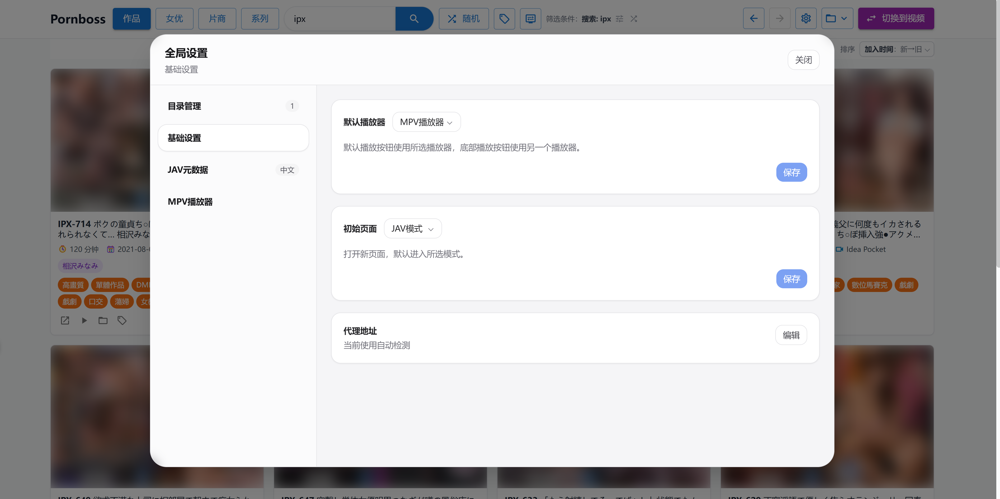
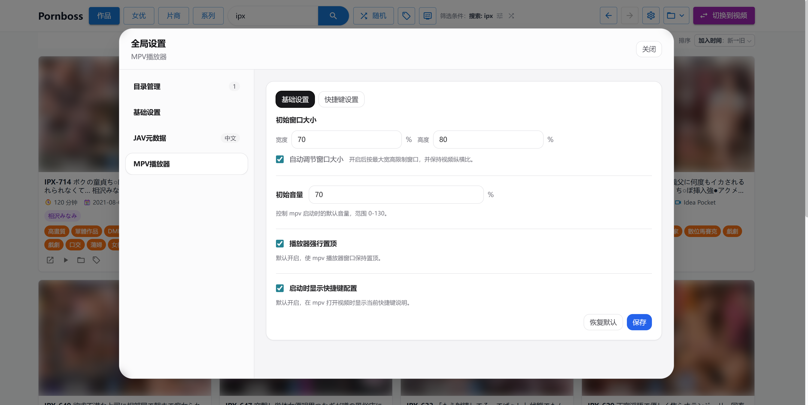
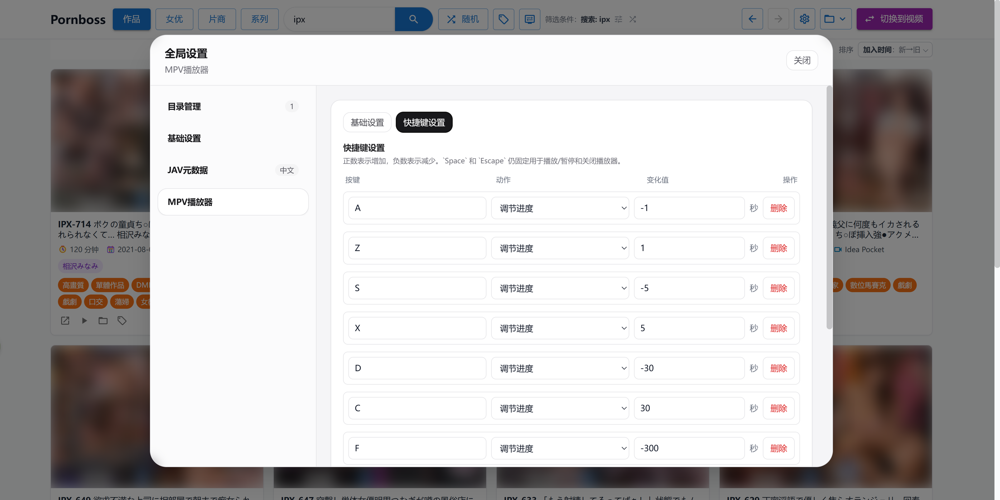

<strong>JavBoss includes native English support. For English documentation, see the <a href="./README.en.md">English README</a>.</strong>

<h1 align="center">JavBoss</h1>

<p align="center">本地成人视频收藏的一站式解决方案：自动扫描目录视频生成封面截图，识别 JAV 并抓取元数据，提供强大的视频和 JAV 检索功能，并通过内置 mpv 播放器快速播放。</p>

<p align="center">
  <a href="https://github.com/Solr159/JavBoss/releases"></a>
  <a href="https://github.com/Solr159/JavBoss/stargazers"></a>
  <a href="https://github.com/Solr159/JavBoss/releases"></a>
  <a href="https://go.dev/"></a>
</p>

<p align="center">
  <a href="./README.md">中文</a> | <a href="./README.en.md">English</a>
</p>

<p>
  
  <a href="https://t.me/+4dje8gAi2dI2ZTE1">官方交流群</a>
</p>


## JavBoss 是什么？

JavBoss 是一个跨平台的本地web应用，提供全方位、全自动化的本地成人视频管理服务，尤其擅长日本AV的管理和检索。

JavBoss的浏览体验和 JavDb、JavBus、JavLibrary 类似，但在它们的基础之上做了优化和改进，追求的是更加直观、更加强大、更加友好的用户体验。

如果你不想折腾任何复杂工具和配置，只想简单导入之后就可以立刻浏览看片，JavBoss将是你的完美选择。

## 快速开始

### 1. 选择安装方式

#### 方式一：命令行一键安装（推荐）

Windows PowerShell：

```powershell
irm https://raw.githubusercontent.com/Solr159/JavBoss/main/scripts/install.ps1 | iex
```

Linux / macOS：

```bash
curl -fsSL https://raw.githubusercontent.com/Solr159/JavBoss/main/scripts/install.sh | bash
```

安装脚本会自动下载对应系统的最新版发布包，完成安装后启动 JavBoss。

以后每次打开：

- Windows：双击桌面的 `JavBoss` 快捷方式，或在开始菜单中搜索 `JavBoss`。
- Linux / macOS：打开终端运行 `javboss`。

#### 方式二：手动下载

点击下载对应系统的最新版发布包并解压：

- [Windows](https://github.com/Solr159/JavBoss/releases/download/v1.8.1/javboss-v1.8.1-windows-x86_64.zip)
- [Linux](https://github.com/Solr159/JavBoss/releases/download/v1.8.1/javboss-v1.8.1-linux-x86_64.zip)
- [macOS-x86_64](https://github.com/Solr159/JavBoss/releases/download/v1.8.1/javboss-v1.8.1-macos-x86_64.zip)（适用于 Intel 芯片的 macOS）
- [macOS-arm64](https://github.com/Solr159/JavBoss/releases/download/v1.8.1/javboss-v1.8.1-macos-arm64.zip)（适用于 M 芯片的 macOS）

也可以前往 [Releases](https://github.com/Solr159/JavBoss/releases) 页面查看所有版本。

下载解压后启动程序：

- Windows：双击 `javboss.exe`。首次运行可能会被 SmartScreen 阻止，点击“更多信息” -> “仍要运行”。
- macOS：打开终端运行 `javboss.command`。
- Linux：打开终端运行 `javboss`。

启动成功后，程序会自动尝试打开浏览器。如果没有自动打开，可以手动访问终端里显示的本地地址。运行过程中请不要关闭终端窗口。

### 2. 添加本地目录

进入“全局设置” -> “目录管理”，添加存放视频的本地文件夹。

视频扫描入库、封面截图生成、JAV 刮削会在后台持续运行，刷新页面或者点击右上角按钮在视频模式和 JAV 模式之间切换查看当前进度。

**注意事项：**
  - 你可以随时关闭应用程序，下次打开所有任务会自动重启。

  - 如果 JAV 模式下始终没数据，中国大陆地区请确保梯子已打开外网访问通畅，然后再等待一段时间。

## 如何升级版本

#### 一键安装用户

先退出正在运行的 JavBoss，然后重新执行一键安装命令即可升级。

#### 手动下载用户

下载并解压新版本后，将旧版本目录中的 `data/` 文件夹复制到新版本目录，然后启动新版本。

（注意要先复制再启动。如果直接启动，程序会自动生成 `data/` 目录，你需要先退出程序，手动删除掉 `data/` 目录再复制）。

## 手动下载老用户迁移一键安装

先执行一键安装命令，然后将手动下载目录中的 `data/` 文件夹复制到一键安装目录中（复制前请先手动删除一键安装目录中的 `data/` 文件夹）。

一键安装默认目录：

- Windows：`C:\Users\你的用户名\AppData\Local\JavBoss` （右键点击桌面快捷方式 -> 属性 -> 打开文件所在位置 即可快速定位）
- Linux：`~/.local/share/javboss`
- macOS：`~/Applications/JavBoss`

之后升级只需要重新执行一键安装命令。


## 部分截图

<p align="center">
  
  
</p>

<p align="center">
  
  
</p>

<p align="center">
  
  
</p>

<p align="center">
  
  
</p>

<p align="center">
  
  
</p>

<p align="center">
  
  
</p>

<p align="center">
  
  
</p>

## 核心理念

- **开箱即用，零外部依赖**：JavBoss 自身已经包含运行所需要的全部依赖，只需要简单添加本地目录，稍等片刻就可立即使用。
<br>

- **全自动化托管式目录服务**：JavBoss 提供的是托管式的本地目录服务，一旦目录内容发生任何变化，所有的数据更新都会由 JavBoss 自动完成，你可以认为 JavBoss 维护的是目录内容的实时全量映射（数据更新需要时间，所以并非零延迟，但是能保证最终一致性）。
<br>

- **零侵入式设计**：JavBoss 充分尊重用户目录的内容，只读取目录绝不做任何修改，用户无需担心 JavBoss 在自己的目录里随意生成各种垃圾（.nfo文件或者各种封面图片），这就意味着 JavBoss 可以无缝与其他视频管理工具协作而不用担心相互影响。
<br>

- **数据永不丢失**：JavBoss 所有的数据保存在项目的`data/`目录中，只要妥善保管好`data/`目录，无论是升级系统、还是更换电脑数据都永远不会丢失。


## ✨ 功能介绍

### 1. 🔎 强大的 JAV 刮削和检索

JavBoss 会从文件名中自动提取番号，例如 `IPX-633`、`SSIS-001`、`ipx633_ch` 等常见格式，并将识别出的影片归入 JAV 媒体库。

- 内部整合多个数据源（javbus、avmoo、theporndb、javdatabase等等），不同信息自动从最合适的数据源获取。
- 支持手动刮削视频到 JAV，解决冷门番号无法被自动刮削的问题。
- 自动抓取作品标题、发行时间、封面、演员、标签等基本信息。
- 自动抓取并补全女优信息，身高、中英文名、三围、出生日期等等。
- 自动抓取并补全 JAV 厂商和系列信息。
- 支持中英文 JAV 元数据抓取，可自由切换。
- 强大的排序功能：支持多种 JAV 和女优排序方式：发行日期、时长、播放次数、身高、年龄、三围等等。
- 强大的查找和筛选功能，支持编辑各种复杂查询（关键字、女优、标签、厂商、系列等）进行分页浏览。
- 强大的随机浏览功能：支持全局随机显示以及任意筛选条件下随机显示。
- 支持作品、厂商、系列、女优收藏夹，并且可以自由排列单个收藏夹内的items顺序，

### 2. 📁 智能目录管理与可迁移数据

添加本地视频目录后，JavBoss 会在后台持续同步目录内容。目录变化会被持续感知并及时刷新，新增、删除、移动文件都会自动反映到媒体库中，已经入库的视频可以立即浏览，扫描和资料补全会逐步完成。

- 支持多个资源目录，适合本机硬盘、NAS 挂载目录、移动硬盘等场景。
- 自动截图生成视频封面，生成视频指纹落库，通过视频文件名尝试关联 JAV 番号。
- 可任意选择启用目录，未启用的目录内容自动隐藏。
- 目录不可用时不会删除历史索引，移动硬盘重新接入后数据会恢复显示。
- 标签、JAV 关联和视频指纹绑定，常见的视频移动、改名场景不用重新打标签。
- 数据库、封面、缩略图等运行数据集中保存在 `data/`，升级或迁移时复制 `data/` 目录即可。

### 3. ⏯️ 内置 mpv 播放器

JavBoss 集成 [mpv](https://github.com/mpv-player/mpv) 播放能力，点击视频即可调用轻量、高性能的本地播放器，适合播放大文件、高码率和各种常见视频格式。

- 通过 mpv 播放原始本地文件，避免浏览器格式兼容性限制。
- 支持默认音量、窗口尺寸、置顶等播放配置。
- 支持自定义快捷键，例如快进、快退、音量调整等。
- 自带 [ModernZ](https://github.com/Samillion/ModernZ) OSC 脚本，mpv 播放时默认使用更现代的播放器控制界面。
- 使用 mpv 播放时可随时截图，截图文件保存在`/data`目录中。
- 在普通视频库和 JAV 作品库中都可以打开截图面板，按时间顺序预览所有 mpv 截图。
- 截图面板支持放大预览、删除截图，并可直接从某张截图对应的时刻继续播放。
- 可在全局设置中选择默认播放器，支持使用 mpv 或系统播放器播放视频，并可定位到文件所在目录。

### 4. 🧭 简单易用的 UI

前端界面围绕“快速找到想看的视频”设计，不堆复杂设置，把常用操作放在筛选、排序、标签和随机浏览上。

- 支持普通视频库、JAV 作品库、女优视角浏览。
- 自适应响应式布局，更小的浏览器缩放倍数下会每行会显示更多的内容。 
- 所有可见信息将尽可能展示，不做复杂的页面嵌套。
- 所有的操作按钮都放在触手可及的位置，尽可能的降低用户心智负担。


## 注意事项

- JavBoss 是本地媒体库管理工具，不是在线视频站。
- JAV 元数据、封面资料首次抓取依赖外部站点可访问性，中国大陆地区请自备梯子。
- 首次导入大库时，扫描、封面抓取、资料补全和缩略图生成需要一些时间。
- 发布包根目录会包含 `config.toml` 文件。默认 `port = 0`，启动时使用随机端口；如果需要固定端口，可随时更改。

## Q&A

- Q: 为什么要做本地web应用而不做桌面端应用？
- A: 这不是技术问题，纯粹是从用户体验角度出发。比如说以下场景都是浏览器的独有优势：
  1. 想同时查看 女优A、女优B的jav，并检索包含关键词C的视频，只要打开多个浏览器标签即可。
  2. 在当前页面想点击查看一个新页面内容，又不想丢失当前页，直接ctrl+鼠标左键或者右键点击选择在新页面中打开。
  3. 不小心点错了，想回到上一页的内容，直接点击浏览器回退按钮。
  4. 看到一个Jav或者女优，想检索一下相关信息，直接鼠标拖动选中文本，右键选择在Google中检索。


<br>

- Q: 使用时要一直确保外网访问通畅吗？
- A: JavBoss 所有的信息读取来源于`\data`目录，已经看到的信息都是永远离线可用的。无法访问外网意味着 JavBoss 无法做后续的 JAV 信息的抓取和更新，已入库的信息不受影响。

<br>

- Q: 添加目录后，怎么知道扫描完成了？需要一直等待吗？
- A: 不需要。JavBoss 会在后台持续扫描和补全信息，添加目录后可以直接开始使用。你也可以随时关闭应用，下次启动后扫描会继续。

<br>

- Q: 添加目录后，为什么我的jav视频出现在了普通视频模式中？
- A: 这是正常现象，jav元数据抓取相比于视频扫描有一定的延迟，所以jav视频也会被先当作普通视屏，只要你的外网访问通畅，稍等片刻此视频就会在普通模式中消失并出现在jav模式中。

<br>

- Q: 新下载的视频怎么入库？想删除一些视频怎么办？
- A: 直接把视频移动进或移出被管理的目录即可。JavBoss 会同步目录状态，新增、移动、删除都会反映到媒体库。

<br>

- Q: 视频文件夹在移动硬盘里，没插硬盘时启动会丢数据吗？
- A: 不会。目录不可用时，JavBoss 会保留已入库数据；移动硬盘再次接入后，数据会恢复显示。

<br>

- Q: 某个移动硬盘不够大了，文件夹要移动到新的硬盘里怎么办？
- A: 直接移动文件夹，然后在“目录管理”里更新目录路径，不用担心数据丢失，JavBoss 会处理好这一切。

<br>

- Q: 换电脑时怎么迁移？
- A: 同系统迁移直接复制整个 `javboss` 目录到新电脑即可运行。跨系统迁移在新电脑下载对应系统的 `javboss`，然后将旧电脑的`data/`目录复制到新电脑的 `javboss` 目录下即可。（注意如果视频目录也发生了变化，你还需要手动在目录管理中进行调整）

## 开发者说明

### 开发环境依赖

- Go `1.25.1` 或更高版本
- Node.js 和 npm

### 技术栈

- Backend: Go + Gin + GORM + SQLite
- Frontend: React + Vite + Tailwind + Zustand
- 媒体探测: `ffprobe`
- 缩略图截图生成: macOS 使用 `ffmpeg`，其他平台使用 `mpv`
- 播放与手动截图: `mpv`

### 常用命令

下载依赖（`ffprobe` + `mpv`，macOS 额外下载 `ffmpeg`）：

```bash
./scripts/cli.sh download linux-x86_64
```

安装前端依赖：

```bash
cd web
npm install
```

启动后端：

```bash
./scripts/cli.sh dev backend
```

启动前端：

```bash
./scripts/cli.sh dev frontend
```

前端检查：

```bash
cd web
npm run lint
npm run build
```

打包发布：

```bash
scripts/cli.sh release linux-x86_64 v0.1.0
```

### 项目结构

```text
cmd/server             Go 服务入口
cmd/javprovider        JAV 元数据 provider 调试入口
internal/common        全局状态与共享配置
internal/db            GORM 模型查询与 SQLite 存储
internal/jav           JAV 元数据与女优资料抓取
internal/manager       封面下载与截图任务
internal/models        数据模型定义
internal/mpv           mpv 播放、快捷键与手动截图配置
internal/server        HTTP API 与静态资源路由
internal/service       目录扫描、JAV 识别、资料补全
internal/util          文件、系统、代理、视频探测等工具
web/                   React + Tailwind 前端
scripts/cli            开发、依赖下载与发布辅助 CLI
data/                  运行期数据库、封面、缩略图与缓存
```
